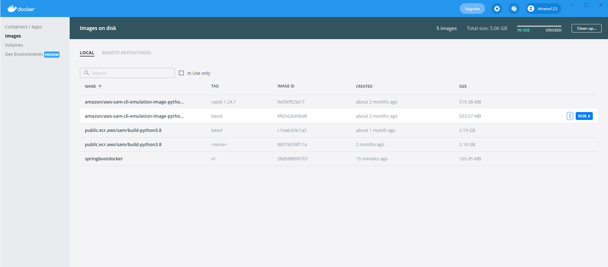
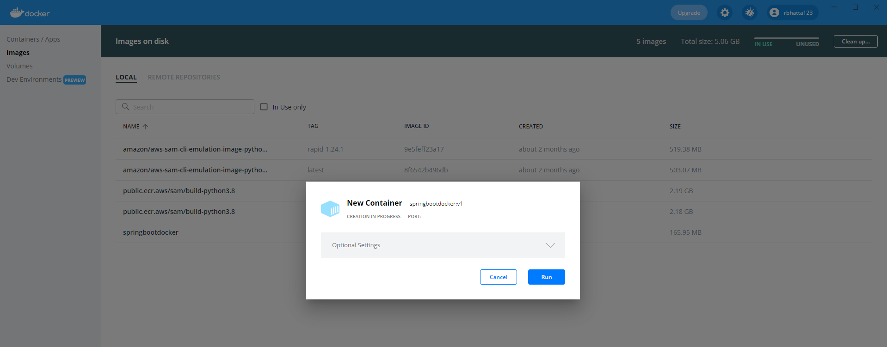
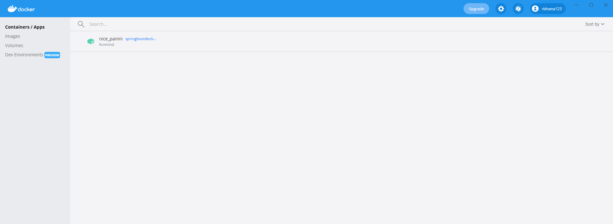
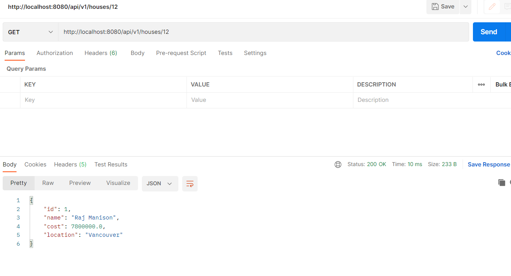

# Creating a docker image using Java Spring Boot #

## Personal docker ID ##
```java
docker ID: rbhatta123
password: oh oh don't expect to get it here LOL
```

## Building application ##
```java
mvn clean package
```
- We first build the application with Maven or Gradle

## Building container image ##
```java
docker build  -t springbootdocker:v1 .
```
- Put executable JAR in a Docker image by running the docker build command from the root project directory containing the Docker file.

## List the docker image ##
```java
docker images 
```

## Output ##
```java
REPOSITORY                                     TAG            IMAGE ID       CREATED          SIZE 
springbootdocker                               v1             28d588890767   22 seconds ago   166MB
public.ecr.aws/sam/build-python3.8             latest         c10a6cb9c1a5   6 weeks ago      2.19GB
amazon/aws-sam-cli-emulation-image-python3.8   rapid-1.24.1   9e5feff23a17   7 weeks ago      519MB
amazon/aws-sam-cli-emulation-image-python3.8   latest         8f6542b496db   7 weeks ago      503MB
public.ecr.aws/sam/build-python3.8             <none>         88376039f11a   2 months ago     2.18GB
```

# Running docker image locally on Windows #
- Get Docker Desktop
- Login using dockerID and password
- Run it locally

## Output for running docker image ##




